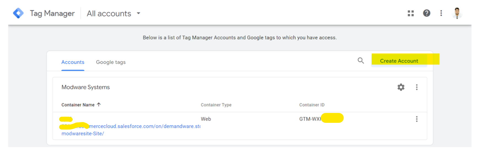
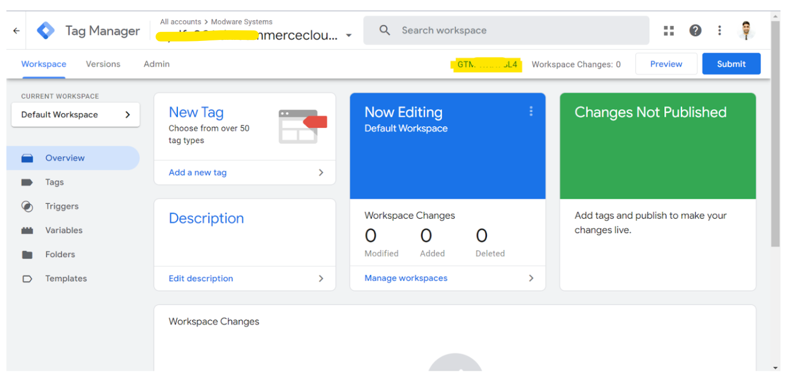
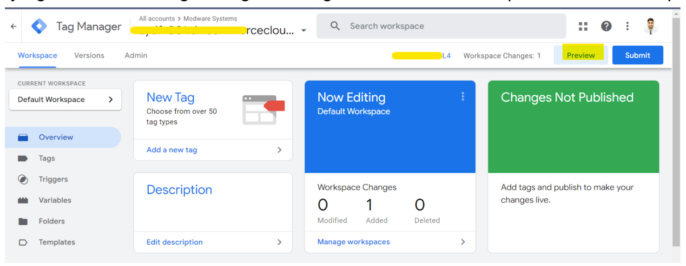
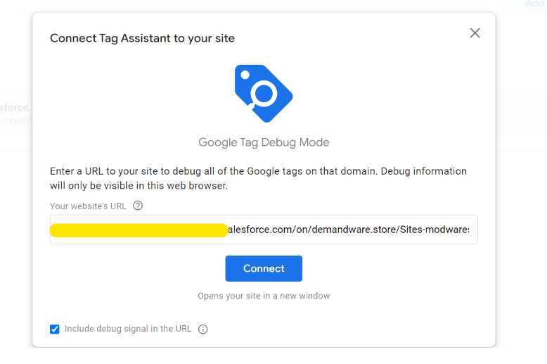
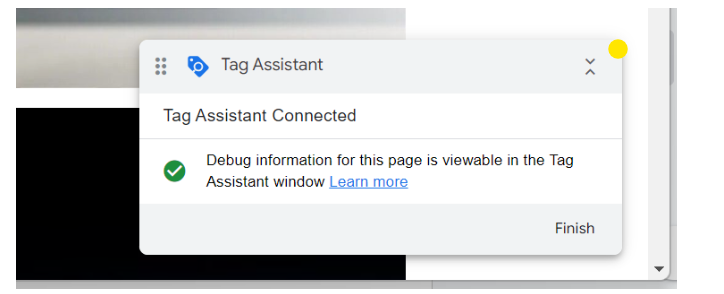
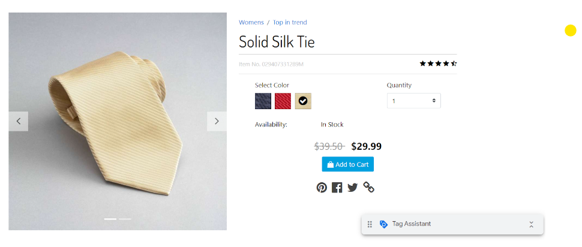
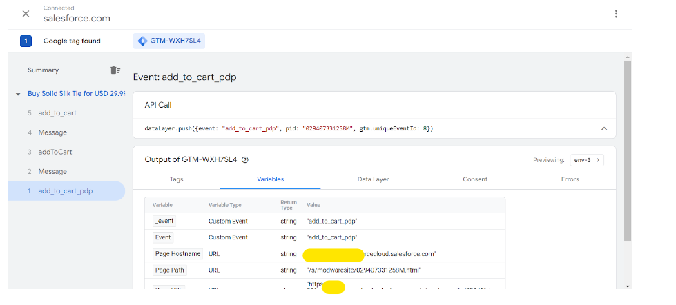
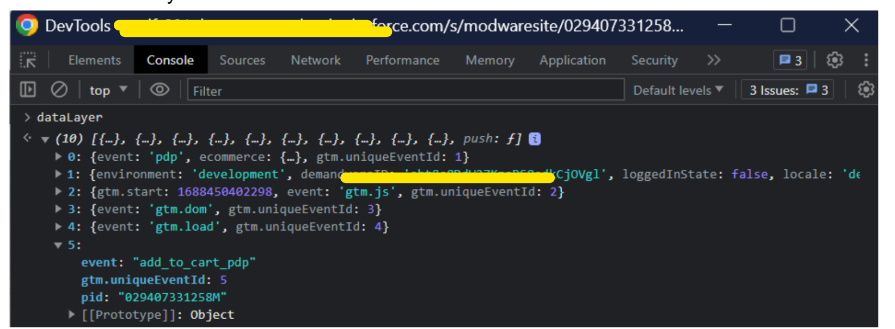

### Author: Gaurav Jangid
### Title: SFCC Cartridge GTM Setup
### Date: 2024-07-24

---

# GOOGLE TAG MANAGER SETUP AND WORKING 🎯

Google tag manager (GTM) is a free tag management platform that enables marketers to deploy and track marketing data by easily adding code snippets to their website or app.

## SETUP
Navigate to [Tag Manager](https://tagmanager.google.com/) and create an account.



After creating the account go to your workspace and click on the container ID to get the code snippet. This snippet is used to install tag manager on the storefront.



Copy the code below and paste it onto every page of your website.
Paste this code as high in the head element of the page as possible:

``` js
<!-- Google Tag Manager -->
<script>(function(w,d,s,l,i){w[l]=w[l]||[];w[l].push({'gtm.start':
new Date().getTime(),event:'gtm.js'});var f=d.getElementsByTagName(s)[0],
j=d.createElement(s),dl=l!='dataLayer'?'&l='+l:'';j.async=true;j.src=
'https://www.googletagmanager.com/gtm.js?id='+i+dl;f.parentNode.insertBefore(j,f);
})(window,document,'script','dataLayer','GTM-ABC7DE4');</script>
<!-- End Google Tag Manager -->
```

Additionally, paste this code immediately after the opening < body > tag:
``` JS
<!-- Google Tag Manager (noscript) -->
<noscript><iframe src="https://www.googletagmanager.com/ns.html?id=GTM-ABC7DE4"
height="0" width="0" style="display:none;visibility:hidden"></iframe></noscript>
<!-- End Google Tag Manager (noscript) -->
```

Now, download the **plugin_gtm** cartridge from github and add to the storefront’s cartridge path and upload in the current active code version.

Import the metadata provided, by creating a zip file.
Navigate to custom preference GTM and update the value of GTMID with your container ID and set GTMenable to yes.

Navigate to your site and in console, type dataLayer then you will see the events created. 👍

> Now let’s create an event in dataLayer named as *add_to_cart_pdp* which will fire on adding a product to cart from the PDP.

Create a file in *templates->default->product->productDetails.isml*.
Copy the base file and add client js using-
assets.addJs(‘js/gtmEvent.js’);

And then in gtmEvent.js file add below code

``` js
'use strict';

var datalayer = window.dataLayer || [];

function createAddToCart(productId) {
    var datalayerObject = {
        event: 'add_to_cart_pdp',
        pid: productId
    }
    datalayer.push(datalayerObject)
}

$(document).ready(function () {
    var $body = $('body');
    var productId = $body.find('.product-id').text().trim();
    $body.on('click', '.add-to-cart', function(){
        createAddToCart(productId);
    })
})
```

Compile the client js and upload the cartridge successfully.

For verifying that the event gets registered, go to the GTM workspace and click on preview



Connect tag assistant to your site by entering the site url



A popup with success will show on storefront



Go to PDP and click on add to cart



And in the preview mode, it can be seen that the event with name add_to_cart_pdp has got fired 💥



Also we can verify the event on console



Similarly we can create other events for all the storefront pages.


## Working of dataLayer

The gtmScript.isml file contains the header script to be placed in head and gtmNoScript contains body script to be placed in body.

The gtmScript.isml is rendered from the **GTM-HtmlHead** route and this route passes GTM related data while rendering. Similarly gtmNoScript is rendered through the **GTM-BeforeHeader** route.

Both of these routes are called through htmlHead and beforeHeader functions defined in *gtmhooks.js* script. (Focus on the use of velocity class in order to call a route from script)

These functions are called through hooks *app.template.beforeHeader*
and *app.template.htmlHead* registered in hooks.json

The *app.template.htmlHead* hook is called from *htmlHead.isml* file which is further included in template of every page of the storefront using *checkout.isml* and *page.isml*

The *app.template.beforeHeader* hook is called directly from *checkout.isml* and *page.isml*

Hence the dataLayer object can be accessed throughout the storefront in order to create events and push. 📍
